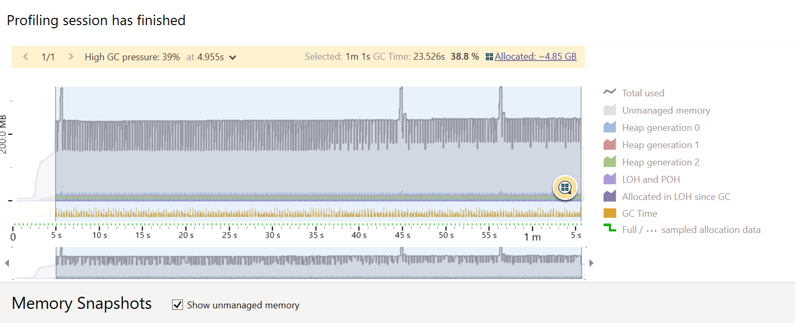

# 🕵️‍♀️ Problem

So here is a (maybe non-)problem I've been experiencing when I tried out Marten at work.

Long story short, whenever I'm trying to fetch a stream (here a stream that doesn't exist).
Marten keeps regenerating the code despite being set up with the automatic code generation mode
leading to an increase unmanaged memory spikes.

- https://martendb.io/configuration/prebuilding.html
- https://martendb.io/configuration/optimized_artifact_workflow.html

F#:

```fsharp
GeneratedCodeMode <- TypeLoadMode.Auto
```

Leading to something like that if you run the program and check its output:

```txt
Generated code to ...MartenPlayground\bin\Debug\net8.0\Internal\Generated\EventStore\EventStorage.cs
...
Generated code to ...\MartenPlayground\bin\Debug\net8.0\Internal\Generated\EventStore\EventStorage.cs
...
Generated code to ...\MartenPlayground\bin\Debug\net8.0\Internal\Generated\EventStore\EventStorage.cs
...
```

Using JetBrains dotMemory:


# ⚙️ The Repro

## 🥨 Was ist das?

A simple .NET 8 F# console program.

To run the repro,

1. Just replace `my-pg-connection-string` and `my-pg-schema` in the `Program.fs`
2. Run the project in debug
3. When being prompted with "Press <enter> to continue when you're ready", you can attach your .NET memory profiler (e.g., JetBrains dotMemory).
4. Well, press `<enter>` and observe 🤔


## 🙇‍♀️ Sorry

Sorry, too busy to create a Docker compose that'd spawn a Grafana, etc.
(I know that'd been a LOT more convenient).
